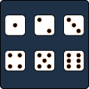

 

  

  <h3 align="center">Sum of Dice</h3>

  

    Calculate the probability of rolling any number, given a set of dice all with the same number of faces.
  

<!-- TABLE OF CONTENTS -->

  
<h2 style="display: inline-block">Table of Contents</h2>

  <ol>
    <li>
      <a href="#about-the-project">About The Project</a>
      <ul>
        <li><a href="#built-with">Built With</a></li>
      </ul>
    </li>
    <li><a href="#roadmap">Roadmap</a></li>
    <li><a href="#license">License</a></li>
    <li><a href="#contact">Contact</a></li>
    <li><a href="#acknowledgements">Acknowledgements</a></li>
  </ol>

<!-- ABOUT THE PROJECT -->
## About The Project
This Java code is based on the formula be Luca Moroni (2015). Used to take number of points to roll (p), number of dice (n), and number of sides on each die (s). Using the three values, the formula calulates the probability of rolling the number, using the die specified.

### Built With

* [Java](https://www.java.com/en/)

<!-- ROADMAP -->
## Roadmap

See the [open issues](https://github.com/SharodeCode/Miscellaneous/issues) for a list of proposed features (and known issues).

<!-- LICENSE -->
## License

Distributed under the GNU License. See `LICENSE` for more information.

<!-- CONTACT -->
## Contact

Jacob McIntyre - [@twitter_handle](https://twitter.com/twitter_handle) - email

<!-- ACKNOWLEDGEMENTS -->
## Acknowledgements

* [Luca Moroni. (2015). The dice roll with a given sum problem.](https://www.lucamoroni.it/the-dice-roll-sum-problem/?fbclid=IwAR2gzuppCLF_SLRbqASVoyOvDINGZWd03EAEH7Hcf2bu3e0jaGFmiay24C0)